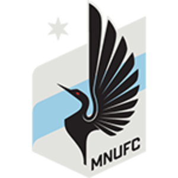
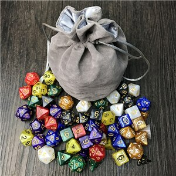

# Homework02: Bootstrap Portfolio

##Introduction

For the second assignment, we were tasked with remaking our portfolio from homework01 from scratch using Bootstrap CSS. We were also meant to include media queries and have the pages look a specific way at breakpoints of 980, 768, and 640.

###Technologies

The portfolio was created in VS Code using html, css, and Bootstrap. The stylings were provided in the homework01 instructions.

####Launch

Nothing too fancy! Simply open it up with your favorite web browser to view it!

#####Status

Like homework01, the shell of the portfolio is complete, but no other projects are linked through it since they don't exist yet. 

######Sources and Inspiration

This time around, instead of using placeholder images in the portfolio gallery, I used real images and put labels on top of them. This was definitely my favorite part to learn and code. HTML code

       

           
Minnesota United FC Quiz

       

       

           
Dice Roller

       

   

   
   CSS code: 
   
   .label {
       position: relative;
       bottom: 75px;
       background-color: #4aaaa5;
       font-family: Arial, Helvetica, sans-serif;
       color: #ffffff;
       text-align: center;
       padding: 10px;
       font-size: 16px;
       width: 100%;
   }

Doing this was intimidating at first, but I found a really great and straightforward article detailing how to do this on w3schools. Within minutes of reading this I finished creating my labels.

(https://www.w3schools.com/howto/howto_css_image_text.asp)

Big shoutout to all 4 TAs who helped me troubleshoot issues I was having throughout the week. Another shoutout to Brennan, who helped me fix some issues with my navbar!
